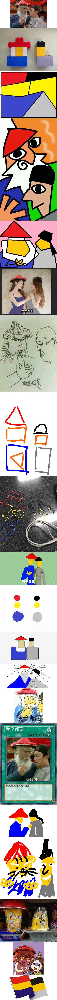

# Signature Image Generator

Generate a signature image from many images.

# [Try It Now](https://gocreating.github.io/signature-image-generator/)

# Examples

## Example 1

The signature image below is built from [these 44 stupid news](https://github.com/gocreating/signature-image-generator/tree/master/examples/stupid-news):

The images are  sourced from [[ＸＤ] 賴床的理由](https://www.ptt.cc/bbs/joke/M.1501078132.A.759.html).

## Example 2

The signature image below is built from [these 17 images](https://github.com/gocreating/signature-image-generator/tree/master/examples/bau-tou):

The images are  sourced from [[神人] 神黑色比基尼那個](https://www.ptt.cc/bbs/Beauty/M.1523627509.A.686.html) and [[正妹] 這畫面太美](https://www.ptt.cc/bbs/Beauty/M.1524927171.A.F75.html).
